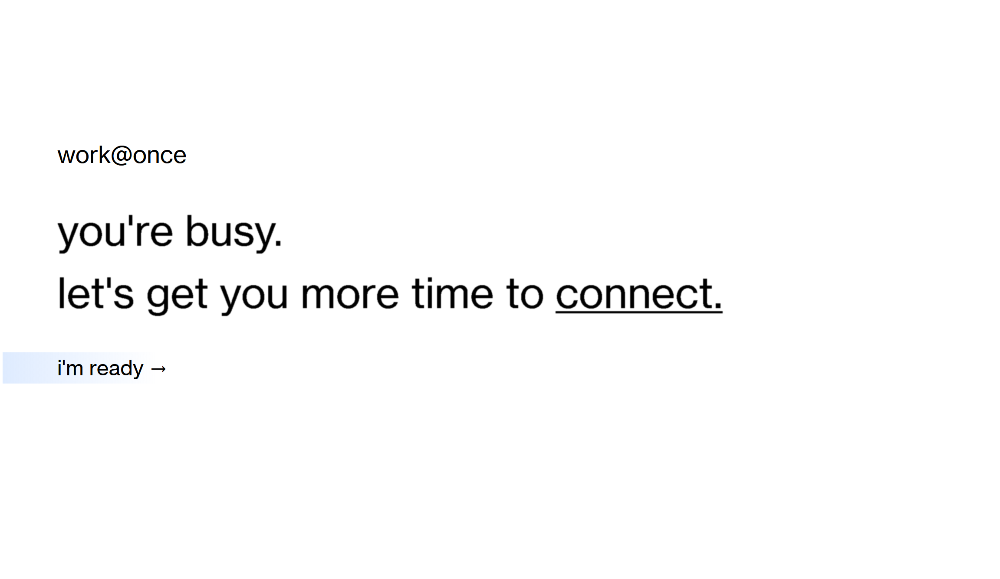
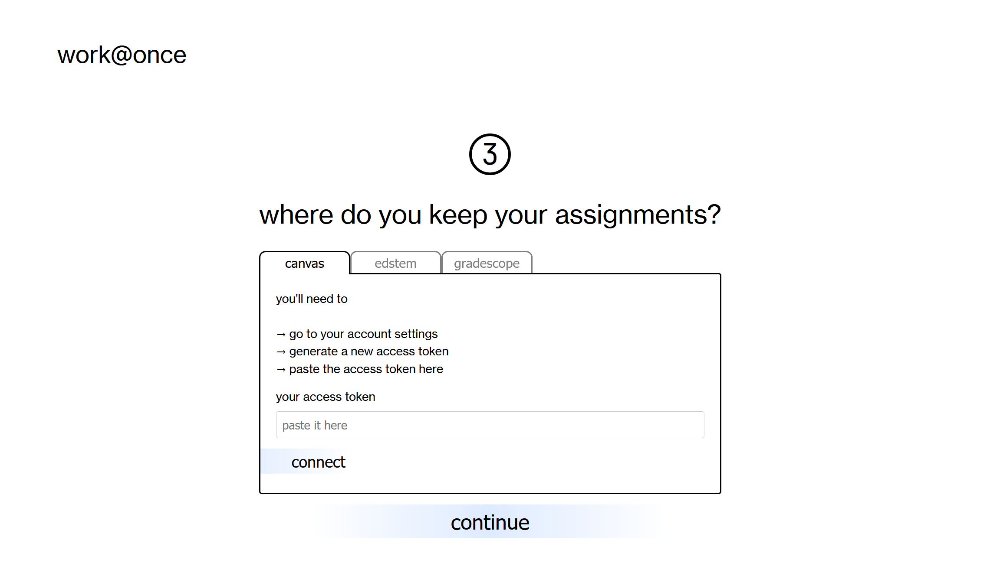
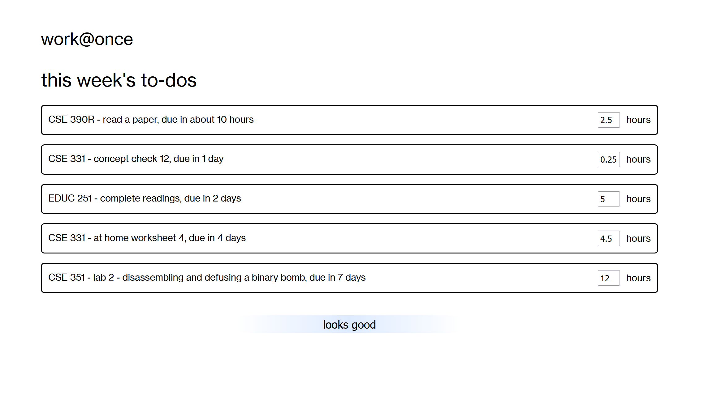
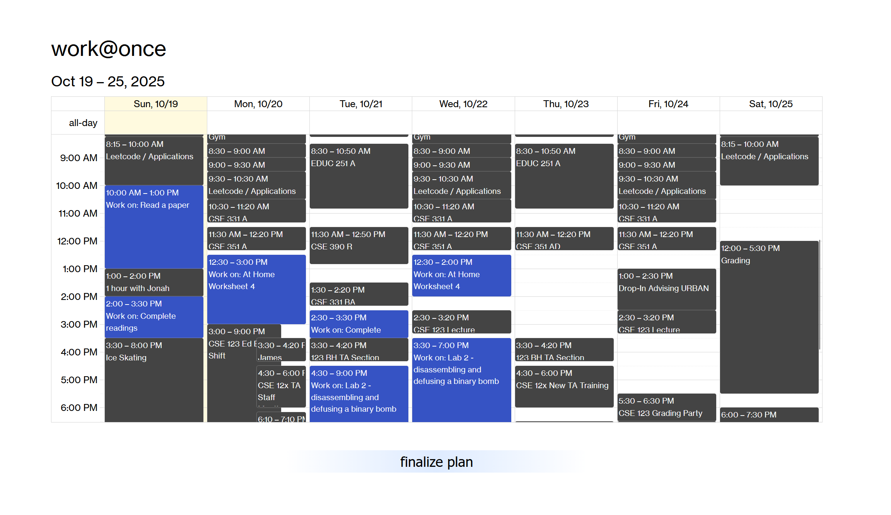

# Work@Once

A hackathon project built for Dubhacks '25. [View the original submission here](https://devpost.com/software/work-once)

### Inspiration

Lately I've gotten really into planning my days out. I like to plan nearly every minute of my day. You'd think that this would save me time, but I've found that planning itself is eating up a good chunk of time. Of course, as a programmer, I thought to myself "I could automate this!"

### What it does

work@once integrates with Google Calendar and your favorite (or not) assignment management services, like Canvas and Edstem. It pulls information from these providers and feeds that information into an AI agent, which estimates how much time the assignment would take to complete. Then, work@once automatically fills the holes in your daily planning with assignment work time! As it schedules, it prioritizes long work sessions so you can get in the vibe, and of course due dates so you don't miss an assignment.

### How I built it

I built it with Svelte and Typescript. I used a Cloudflare worker as a CORS proxy since I was having issues connecting to Edstem and Canvas. For the AI integration, I used OpenAI's client libraries, although I didn't use OpenAI as my AI provider. I had some leftover tokens with another service :D

### Challenges I ran into

As aforementioned, I ran into issues with CORS. Somehow CORS always manages to give me trouble pretty much every project I start.
Accomplishments that I'm proud of

I am pretty proud of the Cloudflare CORS proxy solution. I'm also proud of the design of work@once - I think I really pushed myself when it comes to design.

### What I learned

Time management! I spent so much time making the website look pretty when I could have been strengthening core features. Making your product look good is important, but it doesn't mean anything if your product doesn't work at all.

### What's next for work@once

I would love to add additional scheduling features, such as the ability to define your own work hours (currently it is set to 9am to 9pm for everyone). Also, I ended up faking the assignment data due to time constraints (although the website does make calls to Edstem and Canvas to figure out if the token are correct), so I would like to make that part work for real. I put that part of the work off since I've written similar code to fetch assignments like 3 times in the past two weeks...
